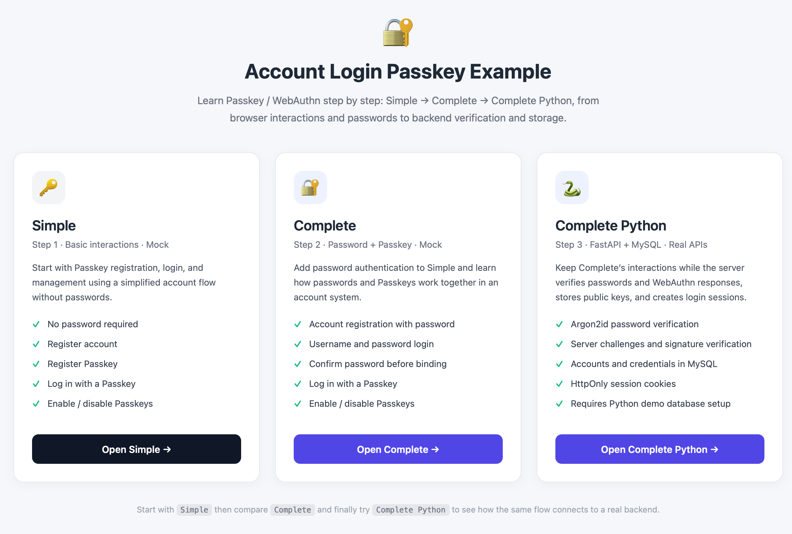

# Complete Reference Implementation for Account Login with Passkey

Version: **0.1.0**

A complete reference implementation demonstrating how to integrate **Passkey authentication** into an account login system.

This project demonstrates the complete Passkey lifecycle — from **registration and credential binding to authentication and account login** — and provides a practical reference for developers integrating modern Passkey authentication into existing account systems.

English | [中文](README.zh-CN.md)


## Interface languages

`0.1.0` includes Chinese and English interfaces. The guide and all examples have a language selector at the top right. The initial choice follows the browser language; a manual choice is remembered across pages and versions on the same origin. Switching preserves account data and input values.

A local dictionary translates page text, buttons, placeholders, dynamic status, and common API errors. Account names and user credential names are not translated. Browser-native form messages, system Passkey dialogs, and the README GIF are outside this page-language control; unrecognized library diagnostics retain their original text.

No frontend framework is needed. Root [i18n.js](i18n.js) holds the dictionary and observes page text updates for asynchronous messages. Each example carries an identical `web/i18n.js` so it remains independently runnable. After adding translations, run from the repository root:

```bash
python scripts/sync-i18n.py
node --test tests/i18n.test.cjs
```

## Open all three examples from the repository root

Each example remains independently runnable. The repository also provides a unified guide page.





### Unified startup

First follow the [Complete Python tutorial](complete-python/README.md) to create its environment, install dependencies, initialize a dedicated MySQL Demo database, and configure `complete-python/.env`. Then, from the repository root:

```bash
source complete-python/.venv/bin/activate
python ./main.py
```

On Windows, activate with `complete-python\.venv\Scripts\activate`. You can also use a Python environment with the required dependencies already installed.

Open [http://localhost:8000/](http://localhost:8000/) and choose a card:

| Page | Address |
| --- | --- |
| Guide | [http://localhost:8000/](http://localhost:8000/) |
| Simple | [http://localhost:8000/simple/web/index.html](http://localhost:8000/simple/web/index.html) |
| Complete | [http://localhost:8000/complete/web/index.html](http://localhost:8000/complete/web/index.html) |
| Complete Python | [http://localhost:8000/complete-python/](http://localhost:8000/complete-python/) |
| Python API documentation | [http://localhost:8000/docs](http://localhost:8000/docs) |

One FastAPI process serves the guide, static examples, and Python APIs. Stop it with `Ctrl+C`. APIs remain at `/api/...`; default RP ID is `localhost` and origin is `http://localhost:8000`. The Mock examples retain their separate localStorage and do not call Python authentication endpoints.

The launcher reads `complete-python/.env` and exposes only that version's `web` directory as static pages. It does not initialize or reset the database. The guide and Mock pages can be served without a configured database, but Python account operations require it.

### Independent startup

Each command block starts from the repository root. Choose one:

```bash
# Simple: Python standard library only
cd simple
python -m http.server 8000 --bind localhost
```

```bash
# Complete: Python standard library only
cd complete
python -m http.server 8000 --bind localhost
```

```bash
# Complete Python: configure its dependencies and database first
cd complete-python
source .venv/bin/activate
python ./main.py
```

Each standalone example opens at [http://localhost:8000/](http://localhost:8000/). Stop the service occupying that port before switching. Unified startup does not require separately starting the subdirectories.

Learning path: [Simple](simple/README.md) → [Complete](complete/README.md) → [Complete Python](complete-python/README.md).


## What is Passkey?

**Passkey** is a modern authentication technology based on **WebAuthn / FIDO2**, designed to replace or complement traditional username-and-password authentication.

Users can authenticate using secure capabilities provided by their devices, including:

* Face ID
* Touch ID
* Windows Hello
* Android biometric authentication
* Device PIN
* Hardware security keys

Passkeys are based on public-key cryptography.

The server stores the **credential public key** and related credential metadata, while the private key remains securely protected by the user's device or authenticator.

The Passkey private key is therefore never stored on or transmitted to the server.

## Project Goals

The primary goal of this project is to demonstrate:

> **How to fully integrate Passkey authentication into an account login system.**

Rather than providing only a minimal WebAuthn API example, this project focuses on how Passkey authentication can be integrated into a real account and authentication architecture.

The project aims to demonstrate:

* A complete Passkey registration flow
* A complete Passkey login flow
* Account-to-Credential relationships
* WebAuthn challenge generation and verification
* Credential lifecycle management
* Integration with traditional account authentication
* A clear and extensible project structure
* Practical integration patterns for real-world applications

## Core Features

### Account Registration and Login

The project supports a traditional account authentication flow and integrates Passkey authentication into the same account system.

```text
Account
 │
 ├── Registration
 │
 └── Login
       │
       ├── Username / Password
       │
       └── Passkey
```

### Passkey Registration

An authenticated user can register a new Passkey for their account.

```text
Account Login
   ↓
Request Passkey Registration
   ↓
Server Generates Challenge
   ↓
Browser / Device Creates Passkey
   ↓
WebAuthn Credential Returned
   ↓
Server Verifies Credential
   ↓
Credential Stored
   ↓
Passkey Registration Complete
```

### Passkey Login

Users can authenticate without entering a password by using a previously registered Passkey.

```text
Login
 ↓
Request Passkey Authentication
 ↓
Server Generates Challenge
 ↓
Browser / Device Performs User Verification
 ↓
Authenticator Generates Assertion
 ↓
Server Verifies Assertion
 ↓
Authentication Successful
 ↓
Create Login Session
 ↓
Login Complete
```

### Multiple Passkeys

A single account can have multiple Passkeys.

For example:

* iPhone
* iPad
* Mac
* Windows PC
* Android device
* Hardware security key

This allows users to authenticate to the same account from multiple devices.

## Authentication Architecture

```text
                    Account
                       │
             ┌─────────┴─────────┐
             │                   │
     Traditional Login        Passkey
             │                   │
      Username/Password      WebAuthn
             │                   │
             └─────────┬─────────┘
                       │
                 Authentication
                       │
                 Session / Token
                       │
                 Authenticated
                    Account
```

## Passkey Registration Flow

```text
Client
  │
  │ Register Passkey
  ▼
Server
  │
  │ Generate Challenge
  ▼
Browser / Authenticator
  │
  │ Create Credential
  ▼
Server
  │
  │ Verify Attestation
  ▼
Credential Storage
  │
  │ Public Key + Metadata
  ▼
Account
```

## Passkey Authentication Flow

```text
Client
  │
  │ Login with Passkey
  ▼
Server
  │
  │ Generate Challenge
  ▼
Browser / Authenticator
  │
  │ User Verification
  │
  │ Generate Assertion
  ▼
Server
  │
  │ Verify Assertion
  ▼
Authenticated Account
  │
  │ Create Session / Token
  ▼
Client
```

## Account and Credential Relationship

A single account can be associated with multiple Passkeys:

```text
Account
│
├── Credential #1
│     ├── Credential ID
│     ├── Public Key
│     └── Metadata
│
├── Credential #2
│     ├── Credential ID
│     ├── Public Key
│     └── Metadata
│
└── Credential #3
      ├── Credential ID
      ├── Public Key
      └── Metadata
```

This design allows users to manage Passkeys across multiple devices.

## Passkey vs. Password

| Feature                     | Password                      | Passkey                     |
| --------------------------- | ----------------------------- | --------------------------- |
| Stored by server            | Password hash                 | Public key                  |
| User memorization           | Required                      | Not required                |
| Secret                      | Password                      | Private key                 |
| Private key storage         | N/A                           | User device / Authenticator |
| Phishing resistance         | Limited                       | Stronger                    |
| Biometric authentication    | Usually indirect              | Supported                   |
| Multi-device authentication | Depends on the account system | Supported                   |
| Web standard                | Traditional authentication    | WebAuthn / FIDO2            |

## Security Model

Passkeys use public-key cryptography for authentication.

A typical authentication flow looks like this:

```text
Client
 │
 │ Challenge
 ▼
Authenticator
 │
 │ Private Key
 │
 │ Sign Challenge
 ▼
Server
 │
 │ Public Key Verification
 ▼
Authentication Result
```

The private key never leaves the authenticator.

The server typically stores:

* Credential ID
* Credential Public Key
* Sign Count
* User ID / Account ID
* Authenticator-related information
* Credential creation time
* Credential last-used time
* Other required metadata

## WebAuthn Security Requirements

For production deployments, special attention should be given to:

* HTTPS
* Origin validation
* RP ID validation
* Challenge expiration
* Replay protection
* Credential verification
* User Verification
* Session security
* Credential revocation
* Account recovery
* Lost-device handling
* Multi-device management

## Use Cases

This project can be used as a reference for:

* Passkey login
* Passwordless authentication
* WebAuthn integration
* FIDO2 authentication
* Adding Passkey support to existing account systems
* Multi-device authentication
* Enterprise authentication
* Website / Web App login
* Mobile account authentication

## Project Scope

This project is designed as a:

> **Complete reference implementation for Account Login + Passkey.**

It focuses on architecture, authentication flows, and key implementation patterns rather than being merely a minimal WebAuthn demo.

The project can be extended with features such as:

* Passkey management
* Passkey deletion
* Passkey naming
* Passkey usage history
* Multi-device management
* Account recovery
* Risk control
* Login auditing
* Session / Token management
* Multi-factor authentication

## Standards and Technologies

This project primarily covers:

* **Passkey**
* **WebAuthn**
* **FIDO2**
* Public Key Cryptography
* Account Authentication
* Session Authentication

## Security Notice

This project is intended primarily for **learning, research, and integration reference**.

For production use, additional security controls should be implemented according to the requirements of the specific application, including account recovery, credential lifecycle management, session security, and suspicious-login handling.

## License

See the `LICENSE` file for license information.
