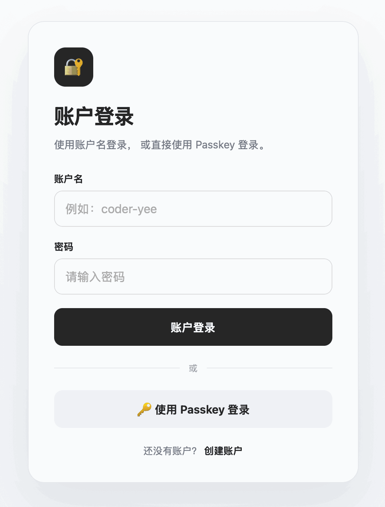
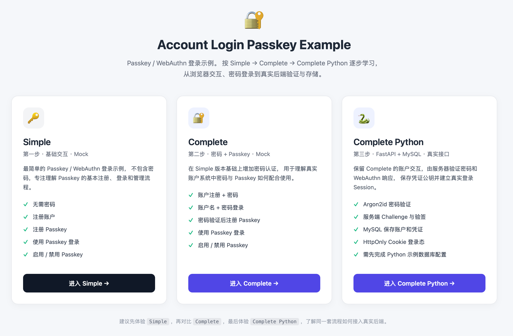

# 账户登录集成 Passkey 的完整参考实现

版本：**0.1.0**

这是一个 **账户登录集成 Passkey 的完整参考实现示例**，用于演示如何将现代 **Passkey / WebAuthn** 认证能力集成到传统的账户登录系统中。

本项目以清晰、完整、可理解的方式展示 Passkey 从**注册、绑定、认证到登录**的完整流程，为需要在现有账户系统中集成 Passkey 的开发者提供参考。

[English](README.md) | 中文



## 界面语言

`0.1.0` 提供中文和英文界面。根目录引导页和三个示例右上角都有语言选择器；首次访问按浏览器语言选择，之后记住手动选择，同一 Origin 下跨页面和版本生效。切换不会重置账户数据或清空输入框。

页面文字、按钮、占位提示、动态状态及常见 API 错误由本地词典处理。账户名和用户凭证名不做翻译；浏览器自己的表单提示、系统 Passkey 弹窗和 README 中的 GIF 不受网页语言选择控制，无法识别的底层库诊断保留原文。

实现不依赖前端框架：根目录 [i18n.js](i18n.js) 保存词典和切换逻辑，通过观察页面文本更新覆盖异步提示。三个示例在自己的 `web/i18n.js` 保留相同副本，以便独立运行。增加文案后，在根目录执行：

```bash
python scripts/sync-i18n.py
node --test tests/i18n.test.cjs
```

## 从根目录打开三个示例

三个目录都可以独立运行；根目录额外提供一个统一引导页。





### 统一启动

首次使用时，先按 [Complete Python 教程](complete-python/README.zh-CN.md) 创建虚拟环境、安装依赖、初始化独立 MySQL 演示库并配置 `complete-python/.env`。之后在仓库根目录执行：

```bash
source complete-python/.venv/bin/activate
python ./main.py
```

Windows 下使用 `complete-python\.venv\Scripts\activate` 激活环境。也可以使用已安装对应依赖的 Python 环境。

打开 [http://localhost:8000/](http://localhost:8000/)，点击三个卡片分别进入：

| 页面 | 地址 |
| --- | --- |
| 根目录引导页 | [http://localhost:8000/](http://localhost:8000/) |
| Simple | [http://localhost:8000/simple/web/index.html](http://localhost:8000/simple/web/index.html) |
| Complete | [http://localhost:8000/complete/web/index.html](http://localhost:8000/complete/web/index.html) |
| Complete Python | [http://localhost:8000/complete-python/](http://localhost:8000/complete-python/) |
| Python API 文档 | [http://localhost:8000/docs](http://localhost:8000/docs) |

同一个 FastAPI 进程提供引导页、静态示例和 Python API，按 `Ctrl+C` 一起停止。Python 接口仍在 `/api/...`，默认 RP ID 为 `localhost`、Origin 为 `http://localhost:8000`。两个 Mock 示例继续使用各自的 localStorage，不调用 Python 认证接口。

根目录服务固定读取 `complete-python/.env`，只将该版本的 `web` 目录公开为静态页面。它不会初始化或清空数据库；未配置数据库时，引导页和两个 Mock 页面仍可访问，但 Python 账户操作需要数据库才能运行。

### 各目录独立启动

以下命令均从仓库根目录开始，选择一个版本执行即可：

```bash
# Simple：仅需 Python 标准库
cd simple
python -m http.server 8000 --bind localhost
```

```bash
# Complete：仅需 Python 标准库
cd complete
python -m http.server 8000 --bind localhost
```

```bash
# Complete Python：先完成自己的依赖与数据库配置
cd complete-python
source .venv/bin/activate
python ./main.py
```

每个版本独立启动后都访问 [http://localhost:8000/](http://localhost:8000/)。切换前先停止占用该端口的服务；统一启动时不需要再分别启动三个子目录。

完整学习路线：[Simple](simple/README.zh-CN.md) → [Complete](complete/README.zh-CN.md) → [Complete Python](complete-python/README.zh-CN.md)。


## 什么是 Passkey？

**Passkey（通行密钥）** 是一种基于 **WebAuthn / FIDO2** 的现代身份认证技术，用于替代或补充传统的用户名和密码登录方式。

用户可以使用设备本身提供的安全认证能力进行登录，例如：

* Face ID
* Touch ID
* Windows Hello
* Android 生物识别
* 设备 PIN
* 硬件安全密钥

Passkey 基于公钥密码学实现。

服务器保存的是 **Credential Public Key（凭据公钥）** 以及相关凭据元数据，而用户的私钥由设备或认证器安全保存。

因此，服务器无需保存用户的 Passkey 私钥。

## 项目目标

本项目主要用于展示：

> **如何将 Passkey 认证完整地集成到一个账户登录系统中。**

重点关注实际项目中的账户与认证体系如何结合，而不仅仅是展示一个简单的 WebAuthn API 调用。

主要目标包括：

* 展示完整的 Passkey 注册流程
* 展示完整的 Passkey 登录流程
* 演示账户与 Passkey Credential 的关联关系
* 演示 WebAuthn Challenge 的生成与验证
* 演示 Credential 生命周期管理
* 演示 Passkey 与传统账户登录体系的结合
* 提供清晰、可扩展的项目结构
* 为实际项目集成提供参考

## 核心功能

### 账户注册与登录

支持传统账户体系的基础登录流程，并在此基础上集成 Passkey。

```text
账户
 │
 ├── 注册
 │
 └── 登录
       │
       ├── 账号密码
       │
       └── Passkey
```

### Passkey 注册

用户登录已有账户后，可以为账户注册一个新的 Passkey。

```text
账户登录
   ↓
请求注册 Passkey
   ↓
服务器生成 Challenge
   ↓
浏览器 / 设备创建 Passkey
   ↓
返回 WebAuthn Credential
   ↓
服务器验证 Credential
   ↓
保存 Credential
   ↓
Passkey 注册完成
```

### Passkey 登录

用户可以使用已经注册的 Passkey 完成无密码登录。

```text
登录
 ↓
请求 Passkey 登录
 ↓
服务器生成 Challenge
 ↓
浏览器 / 设备进行用户验证
 ↓
Authenticator 生成 Assertion
 ↓
服务器验证 Assertion
 ↓
验证成功
 ↓
创建登录 Session
 ↓
登录完成
```

### 多设备 Passkey

一个账户可以关联多个 Passkey。

例如：

* iPhone
* iPad
* Mac
* Windows PC
* Android 手机
* 硬件安全密钥

这样用户可以在多个设备上使用 Passkey 登录同一个账户。

## 整体认证流程

```text
                    Account
                       │
             ┌─────────┴─────────┐
             │                   │
        Traditional Login     Passkey
             │                   │
       Username/Password     WebAuthn
             │                   │
             └─────────┬─────────┘
                       │
                 Authentication
                       │
                 Session / Token
                       │
                 Authenticated
                    Account
```

## Passkey 注册流程

```text
Client
  │
  │ Register Passkey
  ▼
Server
  │
  │ Generate Challenge
  ▼
Browser / Authenticator
  │
  │ Create Credential
  ▼
Server
  │
  │ Verify Attestation
  ▼
Credential Storage
  │
  │ Public Key + Metadata
  ▼
Account
```

## Passkey 登录流程

```text
Client
  │
  │ Login with Passkey
  ▼
Server
  │
  │ Generate Challenge
  ▼
Browser / Authenticator
  │
  │ User Verification
  │
  │ Generate Assertion
  ▼
Server
  │
  │ Verify Assertion
  ▼
Authenticated Account
  │
  │ Create Session / Token
  ▼
Client
```

## Credential 与账户关系

一个账户可以拥有多个 Passkey：

```text
Account
│
├── Credential #1
│     ├── Credential ID
│     ├── Public Key
│     └── Metadata
│
├── Credential #2
│     ├── Credential ID
│     ├── Public Key
│     └── Metadata
│
└── Credential #3
      ├── Credential ID
      ├── Public Key
      └── Metadata
```

这种设计可以支持用户管理多个设备上的 Passkey。

## Passkey 与传统密码的区别

| 项目     | 密码      | Passkey              |
| ------ | ------- | -------------------- |
| 服务器保存  | 密码哈希    | 公钥                   |
| 用户记忆   | 需要      | 不需要                  |
| 私密信息   | 密码      | 私钥                   |
| 私钥存储   | 无       | 用户设备 / Authenticator |
| 抗钓鱼能力  | 较弱      | 更强                   |
| 生物识别   | 通常不直接支持 | 支持                   |
| 多设备    | 依赖账号系统  | 支持                   |
| Web 标准 | 传统认证    | WebAuthn / FIDO2     |

## 安全设计

Passkey 使用公钥密码学进行身份认证。

典型情况下：

```text
Client
 │
 │ Challenge
 ▼
Authenticator
 │
 │ Private Key
 │
 │ Sign Challenge
 ▼
Server
 │
 │ Public Key Verification
 ▼
Authentication Result
```

私钥不会发送给服务器。

服务器主要保存：

* Credential ID
* Credential Public Key
* Sign Count
* User ID / Account ID
* Authenticator 相关信息
* Credential 创建时间
* Credential 最后使用时间
* 其他必要元数据

## WebAuthn 安全要求

生产环境部署时，需要重点处理：

* HTTPS
* Origin 校验
* RP ID 校验
* Challenge 过期
* Challenge 防重放
* Credential 验证
* User Verification
* Session 安全
* Credential 撤销
* 账户恢复
* 设备丢失处理
* 多设备管理

## 适用场景

本项目适合用于学习和参考以下场景：

* Passkey 登录
* 无密码登录
* WebAuthn 集成
* FIDO2 认证
* 传统账户系统增加 Passkey
* 用户多设备认证
* 企业账户认证
* 网站 / Web App 登录
* 移动端账户认证

## 项目定位

本项目定位为：

> **Passkey + Account Login 的完整参考实现。**

它重点展示架构、认证流程以及关键实现方式，而不是单纯提供一个最小化的 WebAuthn Demo。

你可以基于本项目进一步扩展：

* Passkey 管理
* 删除 Passkey
* 修改 Passkey 名称
* 查看 Passkey 使用记录
* 多设备管理
* 账户恢复
* 风险控制
* 登录审计
* Session / Token 管理
* 多因素认证

## 技术标准

本项目主要涉及：

* **Passkey**
* **WebAuthn**
* **FIDO2**
* Public Key Cryptography
* Account Authentication
* Session Authentication

## 安全说明

本项目主要用于**学习、研究和集成参考**。

如果用于生产环境，请根据实际业务场景进一步完善安全策略、账户恢复机制、Credential 生命周期管理以及异常登录处理。

## License

详见项目中的 `LICENSE` 文件。
